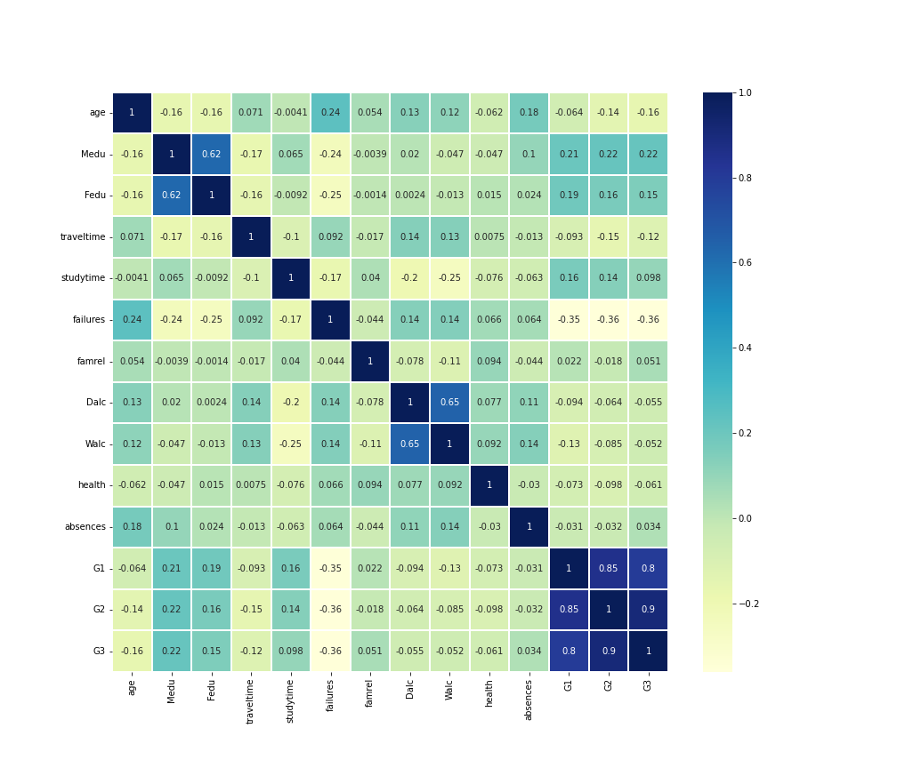

# Group 33 - - High School Never Ends

## Introduction

Our project looks at influences of the high school adolescent experience. Adolescence is experienced by everyone, and we knew that the data in this dataset could offer answers to questions that we've had during high school or in post secondary. This project is important as it details information on academic influences, alcohol consumption, relationships, and other relatable aspects that all youth are influenced by.

## Exploratory Data Analysis

A summary of the highlights of your EDA, where you can show some visualizations of the exploratory data analysis your group did.

This heatmap offers an insight into the correlations within this dataset. It was used to help find interesting relationships between variables that our group was interested in.

## Question 1 + Results:
 Clearly state your research question, and include 2-3 visualizations that helped you answer your research question. You can create multi-panel figures, but each of your visualizations must speak directly to your research question, and any insights you were able to get from it should be clearly articulated in the figure caption/description.

## Question 2 + Results

My research question looked at whether parental education status influences student academic success. [To look further into my analysis and data, please look here](notebooks/analysis2.ipynb).

This graph looks at the influence of parental education on their children's grades. Within this graph, we can see a scattered spread of data along with a regression line. This regression line, or best fit line, is showing a positive correlational relationship between these two variables. As parental education increases, so do their children's grades. 

This graph adds the number of failures into consideration, as that is another aspect of academic success. There are many more blue spots along the top of the graph than along the bottom of the graph, which has lots of orange, green, and red spots. These upper blue spots symbolize a lack of failures, while the other colours symbolize an increasing number of failures. Due to the higher occurence of other-coloured spots further down the graph, we can determine that grades and number of failures have a negative correlation with one another.

Another relationship that is shown within this graph is the connection between number of failures and parental education. The red and green dots, which indicate a higher number of failures, are mostly present amongst lower parental education statuses. This shows a negative correlation between parental education and number of failures.

In conclusion, yes there is a positive correlation between parental education status and academic success. This was determined by looking at two factors of academic success, grades and number of failures.

## Question 3 + Results

## Summary/Conclusion

 A brief paragraph that highlights your key results and what you learned from doing this project.

 Madisyn's key results and what you learned from doing this project:
    Key results: yes, parental education status influences their children's academic success.   
 I learned a lot about adolescent experience through this project. There are so many factors preventing high school children from succeeding, whether that be alcoholic pressure, family, or romantic relationships. Youth need more support to be able to thrive within the highschool system.