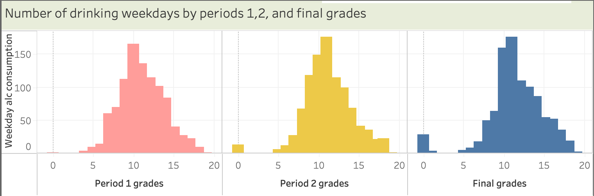

# Group 33 - - High School Never Ends

## Introduction

Our project looks at influences of the high school adolescent experience. Adolescence is experienced by everyone, and we knew that the data in this dataset could offer answers to questions that we've had during high school or in post secondary. This project is important as it details information on academic influences, alcohol consumption, relationships, and other relatable aspects that all youth are influenced by.

## Exploratory Data Analysis

A summary of the highlights of your EDA, where you can show some visualizations of the exploratory data analysis your group did.

This pairplot comprises of data we used for data wrangling.

This heatmap offers an insight into the correlations within this dataset. It was used to help find interesting relationships between variables that our group was interested in.

## Question 1 + Results:

My research question was to examine whether or not there is correaltion between alcohol consumption and student percentile. [If you are interested in taking a closer look click this link](notebooks/analysis1.ipynb).

For each period I compared the weekday and weekend alcohol consumption to student percentile, and found that they are very similar for all periods. To make conclusions we can take them as almost identical.

As we can see it is not a negative linear  graph but tuns out it is a normal curve. At extremes of succession, there seems to be close to zero alc consumption (for both weekdays and weekends) and around the middle we get the peak amount of acc consumption.

This is interesting as this falsifies my hypothesis that there's a negative correlation, because students with higher academic percentiles tend to study more during times that other students are partying. If my hypothesis were correct we would have a negative linear graph, but we in fact have a normal curve. 

## Question 2 + Results

My research question looked at whether parental education status influences student academic success. [To look further into my analysis and data, please look here](notebooks/analysis2.ipynb).

This graph looks at the influence of parental education on their children's grades. Within this graph, we can see a scattered spread of data along with a regression line. This regression line, or best fit line, is showing a positive correlational relationship between these two variables. As parental education increases, so do their children's grades. 

This graph adds the number of failures into consideration, as that is another aspect of academic success. There are many more blue spots along the top of the graph than along the bottom of the graph, which has lots of orange, green, and red spots. These upper blue spots symbolize a lack of failures, while the other colours symbolize an increasing number of failures. Due to the higher occurence of other-coloured spots further down the graph, we can determine that grades and number of failures have a negative correlation with one another.

Another relationship that is shown within this graph is the connection between number of failures and parental education. The red and green dots, which indicate a higher number of failures, are mostly present amongst lower parental education statuses. This shows a negative correlation between parental education and number of failures.

In conclusion, yes there is a positive correlation between parental education status and academic success. This was determined by looking at two factors of academic success, grades and number of failures.

## Question 3 + Results

#### Question 3: 
My research question deals with the correlation between the interpersonal relations of the students, the amount of alcohol they consume weekly and their grade averages. I delved into the students' quality of family relationships and whether or not they are in a romantic relationship.  These aspects are then contrasted with their weekly alcohol intake. 

||
|:--:|
|The graph above suggests that the students who are in a relationship and have low quality of relationship with their family consume less alcohol while the opposite consume more|

||
|:--:|
|The graph above suggests that there is a negative correlation between the average alcohol consumed and the average Portuguese grades of the students|

These graphs prove that there is a relation between all the components stated above. 

For the complete analysis about the research questions, refer to the [jupyter notebook](notebooks/analysis3.ipynb).

## Summary/Conclusion

 A brief paragraph that highlights your key results and what you learned from doing this project.

 

 Erem's key results and what you learned from doing this project:

     - There does not seem a big correlation between alcohol consumption and student results. I initially predicted that there would be a negative correlation (giving a negative linear graph), however there was a normal curve. I believe that both alcohol consumtion and student percentile follow the normal curve and therefore dont end up affecting eachother in a noticeable way, having most students near the middle for both.

 Madisyn's key results and what you learned from doing this project:

    Key results: yes, parental education status influences their children's academic success.   

 I learned a lot about adolescent experience through this project. There are so many factors preventing high school children from succeeding, whether that be alcoholic pressure, family, or romantic relationships. Youth need more support to be able to thrive within the highschool system.

 Jyo's key results and what you learned from doing this project: Conclusion: There is direct correlation between alcohol consumed, average grades and interpersonal relations of students. 

From this project I have inferred that social lives of students heavily impact their drinking habits. WHich in turn impacts their grades. I deduce that three possibly cause the other. This highlights the shortcommings of the adults providing for the students.

